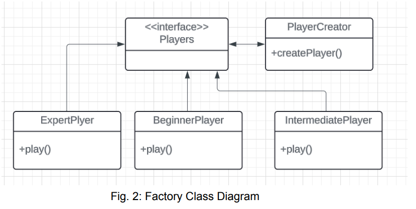
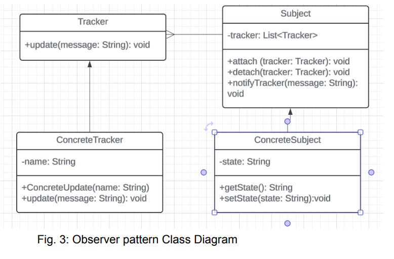
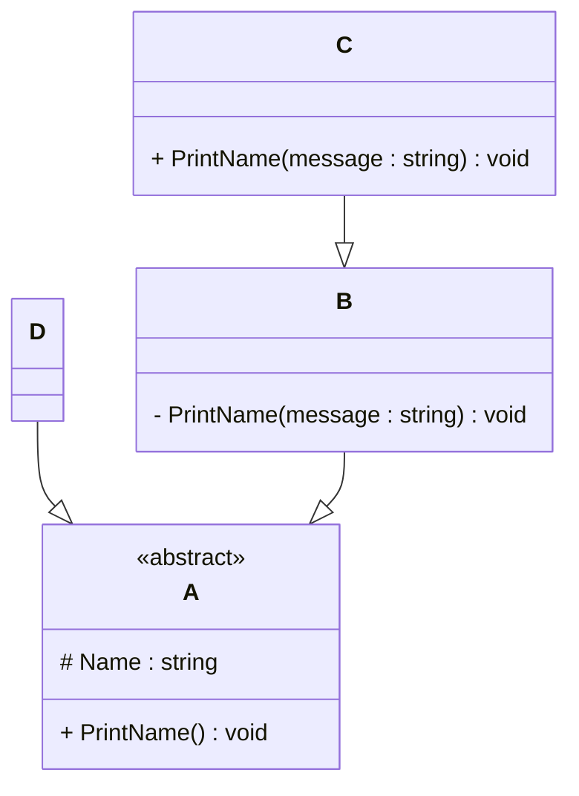

# Programming Test

This test was composed to create a general overview of your knowledge regarding general programming and how it fits with the needs in our lab. Please try to answer all questions using your own knowledge and in your own words. If you get stuck on one of the exercises, still try to give a short answer.

---

## Exercise 1

### Task
Write a program in the language of your choice where:

1. The iteration number (starting from 1), followed by a random number between 1 and 100, is printed 100 times.
2. After every 5 iterations, write an additional separator (e.g., `---`).
3. Write “Lucky number!” after every random number that is divisible by 7.

> Try to keep the procedure as short as possible.
>>>> For solution, please check Exercise1.java Class which is in src.entryAssessment directory

---

## Exercise 2

### 1. **What is your understanding of the term “Design Patterns”?**  
   Provide a description in your own words.
   >>>>Design patterns are like well-established blueprints or reusable solutions to common problems that arise when designing software. Think of them as a catalog of effective ways to structure code and organize relationships between classes and objects. They don't provide concrete code that you can directly copy and paste, but rather offer abstract, high-level descriptions of how to approach a particular design challenge. They represent best practices that have evolved over time and have been proven to lead to more maintainable, flexible, and understandable software. They're essentially a shared vocabulary and a body of knowledge that helps developers communicate more effectively about design choices.

### 2. **Explain the MVC Pattern**  
   - What does MVC stand for?  
      MVC stands for Model View Controller.

   - Explain the pattern in detail.  
      It's an architectural design pattern that separates an application into three interconnected components to isolate concerns and improve code organization.

a. Model: This component manages the application's data and business logic. It's responsible for retrieving, storing, and manipulating data. The model is independent of the user interface and doesn't know how the data will be presented. It notifies its observers (typically the view) when its data changes.

b. View: This component is responsible for presenting the data to the user. It displays the information held by the model. Multiple views can exist for a single model, providing different ways to visualize the data. The view typically observes the model and updates itself when the model changes. It also forwards user input to the controller.

c. Controller: This component acts as an intermediary between the model and the view. It handles user input from the view, updates the model accordingly, and selects which view to display. The controller contains the application's control flow and logic.

   - What are some use cases for this framework?
   Alright, let's dive into design patterns!

What is your understanding of the term “Design Patterns”?
In my understanding, design patterns are like well-established blueprints or reusable solutions to common problems that arise when designing software. Think of them as a catalog of effective ways to structure code and organize relationships between classes and objects. They don't provide concrete code that you can directly copy and paste, but rather offer abstract, high-level descriptions of how to approach a particular design challenge. They represent best practices that have evolved over time and have been proven to lead to more maintainable, flexible, and understandable software. They're essentially a shared vocabulary and a body of knowledge that helps developers communicate more effectively about design choices.

Explain the MVC Pattern
MVC stands for Model-View-Controller. It's an architectural design pattern that separates an application into three interconnected components to isolate concerns and improve code organization.

Model: This component manages the application's data and business logic. It's responsible for retrieving, storing, and manipulating data. The model is independent of the user interface and doesn't know how the data will be presented. It notifies its observers (typically the view) when its data changes.

View: This component is responsible for presenting the data to the user. It displays the information held by the model. Multiple views can exist for a single model, providing different ways to visualize the data. The view typically observes the model and updates itself when the model changes. It also forwards user input to the controller.

Controller: This component acts as an intermediary between the model and the view. It handles user input from the view, updates the model accordingly, and selects which view to display. The controller contains the application's control flow and logic.

Here's a simple diagram illustrating the MVC pattern:

Code snippet

graph TD
    A[User Input] --> B(Controller);
    B --> C{Update Model?};
    C -- Yes --> D(Model);
    D -- Notify --> E(View);
    B -- No --> E;
    D --> F{Retrieve Data?};
    F -- Yes --> E;
    E -- Display --> A;
Use cases for the MVC framework:

The MVC pattern is widely used in various types of applications, particularly those with a significant user interface:

Web Applications: Frameworks like Ruby on Rails, Django (Python), and Spring MVC (Java) heavily rely on the MVC pattern to structure web applications, separating data handling, presentation (HTML/CSS), and user interaction logic.
Desktop Applications: While perhaps less dominant than in web development, MVC (or variations like Model-View-ViewModel - MVVM) can be used to structure complex desktop applications with graphical user interfaces.
Mobile Applications: Many mobile development frameworks also adopt MVC or similar architectural patterns to manage the user interface and application logic effectively.

### 3. **List three other design patterns**  
   - Provide names and details for three additional design patterns.
   - Explain how you have used those patterns in the past and how they have solved your problem  
   - Use diagrams to explain the design patterns.
>>>> 1. Singleton Pattern: This pattern ensures that a class has one instance and provides a global point of access to it. In other word, this pattern is used when one object is needed to coordinate actions across the system
>>How have I used it? 
During my project “Typing Racer” a server was responsible to maintain the participant's login authentication, sorting the participants into groups. In that project, I followed this pattern to create a single instance of the server that managed all the groups and user sessions. It ensured that the server state remained consistent across all clients (participants).

2. Factory Pattern: Factory Pattern provides an interface for creating objects in a super-class but allows subclasses to alter the type of objects that can be created.
How have I used it?
In my Typing Racer project, I have used the factory pattern to create different types of players and game sessions. One of the feature that can related to factory pattern was that it created a different type of players or participants based on their typing level. This allowed me to extend the system easily by adding new types of players without altering the core logic.

3. Observer Pattern: Observer patter defines a one-to-many dependency between objects so that when one object changes state, all its dependent are notified and updated automatically.
How have I used it?
In my project “N-Queen Solver” the task of the program was to place queens in safe places from each other. Observer pattern was used to keep the GUI (chessboard) updated whenever a new queen is placed on the board. Queens were placed in safe places using a backtracking algorithm. This allowed the chessboard to respond to changes in real-time, providing a dynamic and interactive user experience.
 

---

## Exercise 3

### 1. **Implementation Task**  
   Based on the class diagram below, provide an implementation in any object-oriented programming language of your choice.
   

>>> for coding part, please check entryAssessment package which is inside src directory 

### 2. **Key Questions**  
   - Are you able to directly create a new instance of `ObjectA`? Please explain your answer.  
   No, we cannot directly create an instance of ObjectA because A is declared as an abstract class. Abstract classes cannot be instantiated; they are meant to be subclassed, and concrete implementations are created from the subclasses.

   - Given an instance of `ObjectC`, are you able to call the method `PrintMessage` defined in `ObjectB`? Please explain your answer.  
   No, given an instance of ObjectC, we cannot directly call the PrintName method defined in ObjectB. ObjectC and ObjectB are distinct classes with their own methods. They are not related by inheritance in a way that allows direct method invocation between instances. ObjectB's PrintName method is specific to instances of class B (or its subclasses)

   - Try to explain as many key features of object-oriented programming as you can find in this example.

   1. Abstraction: The A class is declared as abstract. This means we cannot create direct instances of A. It serves as a blueprint for its subclasses (B in this case), defining a common interface (the PrintName() method) without providing a complete implementation.

2. Inheritance: The B class extends the A class. This means B inherits the Name protected member from A and is required to provide a concrete implementation for the abstract method PrintName().

3. Encapsulation: In class B, the PrintName(String message) method is declared as private. This restricts its access from outside the B class, demonstrating encapsulation by controlling how the internal state and behavior of the object are accessed.

4. Polymorphism: The PrintName() method is declared in the abstract class A and then implemented differently in the concrete class B. When objectD.processA() is called, it invokes the PrintName() method on the aObject reference. Because aObject is currently referencing an instance of B, the PrintName() implementation in B is executed. This demonstrates runtime polymorphism, where the actual method executed depends on the object's type at runtime.

---

## Exercise 4

### Maintaining and Expanding Software for Component Validation

This exercise focuses on strategies for working with existing code bases and ensuring the software remains maintainable as new features and requirements are introduced.

### 1. **Working with Existing Code**  
- How would you approach understanding and contributing to an existing code base with minimal disruption?  
>> I would:
   a. Study the Codebase: Start by reviewing the project’s documentation, architecture diagrams, and README files. Run the software locally to understand its behavior. Use tools like debuggers or profilers to trace execution flow.

b. Engage with Stakeholders: Collaborate with team members or maintainers to grasp the codebase’s context, conventions, and pain points. Ask about critical components and recent changes.

c. Start Small: Begin with small, low-risk tasks (e.g., bug fixes or minor enhancements) to familiarize yourself with the codebase without introducing significant disruptions.

d. Use Version Control Effectively: Work in feature branches, commit changes incrementally, and write clear commit messages to track each contributions and facilitate reviews.

- What practices would you follow to ensure your changes integrate well with the current structure?
>>I would:
a. Follow Existing Conventions: Adhere to the codebase’s coding style, naming conventions, and structure. Use linters or formatters (e.g., Prettier) to ensure consistency.

b. Write Tests: Create unit and integration tests for your changes to verify they don’t break existing functionality. Run the full test suite before submitting changes.

c. Leverage Code Reviews: Submit pull requests for peer review to catch potential issues and align with team expectations.

d. Refactor Incrementally: If I spot areas for improvement, I would make small, focused refactorings rather than large-scale rewrites to minimize risk.  

### 2. **Ensuring Maintainability**  
- What techniques would you use to keep the code base clean, modular, and easy to maintain as new features are added?  
>>I would:
a. Modular Design: Break code into small, cohesive modules or components with clear interfaces. Use separation of concerns to ensure each module handles a single responsibility.

b. Refactor Regularly: Apply techniques like extracting functions, simplifying conditionals, or removing duplication to keep code readable and maintainable.

c. Enforce Code Quality: Use static analysis tools (e.g., SonarQube) and CI/CD pipelines to catch issues early. Set up automated formatting and linting to maintain consistency.

d. Limit Dependencies: Minimize external dependencies to reduce complexity and avoid version conflicts. When adding dependencies, evaluate their long-term support.

- How would you handle code documentation and testing to support long-term maintainability?
>>I would follow:
a. Comprehensive Documentation: Maintain up-to-date documentation, including high-level architecture overviews, API references, and setup guides. Use tools like JSDoc or Sphinx for inline code comments and generated docs.

b. Document Intent: For complex logic, include comments explaining why the code exists, not just what it does. Update READMEs or wikis with new feature details.

c. Robust Testing: Write unit tests for individual components, integration tests for interactions, and end-to-end tests for critical workflows. Aim for high test coverage (e.g., 80%+) and use test-driven development (TDD) where applicable.

d. Automate Testing: Integrate tests into CI/CD pipelines (e.g., GitHub Actions, Jenkins) to run on every commit or pull request. Include regression tests to catch unintended side effects.  

### 3. **Balancing Flexibility and Stability**  
- How would you design or refactor the software to make it flexible for future changes while ensuring the existing functionality remains stable?
I would:
a. Encapsulate Change: Identify areas likely to change (e.g., validation rules, data formats) and isolate them behind interfaces or abstractions. This limits the impact of future modifications.

b. Incremental Refactoring: Refactor gradually by improving one module or component at a time, ensuring each change is tested and doesn’t break existing functionality.

c. Versioning: Use semantic versioning for APIs or libraries to signal breaking changes. Provide backward compatibility where possible to maintain stability.

d. Feature Flags: Implement feature toggles to roll out new functionality gradually, allowing you to test in production without affecting all users.

- Which design patterns or principles would you apply to achieve this balance
>> I would apply:
1. SOLID Principles:
a. Single Responsibility Principle: Ensure each class/module has one job, making it easier to modify without affecting unrelated functionality.

b. Open/Closed Principle: Design modules to be open for extension (e.g., via plugins or subclasses) but closed for modification, preserving existing behavior.

c. Interface Segregation Principle: Create specific interfaces for different use cases to avoid forcing components to depend on unused functionality.

2. Design Patterns:

a. Strategy Pattern: Use for interchangeable validation algorithms, allowing new rules to be added without modifying existing code.

b. Factory Pattern: Centralize object creation for components, making it easier to swap implementations or add new types.

c. Observer Pattern: Enable loose coupling for event-driven systems, such as notifying components of validation results.

Also, I would follow:
3. DRY (Don’t Repeat Yourself): Eliminate code duplication by extracting shared logic into reusable functions or modules.
4. YAGNI (You Aren’t Gonna Need It): Avoid over-engineering by only implementing features that are currently required, keeping the codebase lean.

---
